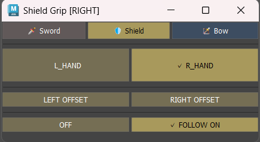
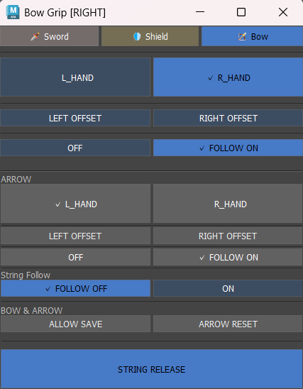
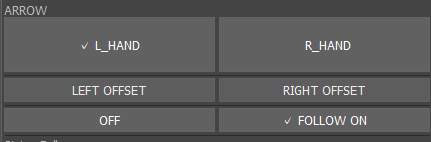
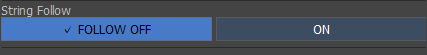

# Equipment Manager for Maya






Autodesk Maya 2026向けの、**武器・プロップの持ち替えと追従状態を管理するアニメーション支援ツール**です。

Sword、Shield、Bow、Arrow、Stringの操作を1つのUIへまとめ、Constraint WeightやSpace Attributeを手作業で切り替える際の操作負担や設定漏れを減らすことを目的としています。
また、アニメーターの要望により全機能において武器コントローラーに直接キーフレームを打つことを可能にするなど、改良を重ねました。

本ツールは、キャラクター **Diana** の武器リグ制作で使用したワークフローをもとに、処理の責務を整理し、保守・拡張しやすい構成へ再設計しています。

---

## Features

### Equipment Switching

Sword、Shield、Bowの持ち手を左右で切り替えます。

装備ごとに設定されたSpace AttributeやConstraintを操作し、現在の持ち手を変更します。

左右それぞれにTransform Offsetを保存でき、持ち手を切り替えた際には保存済みのOffsetを復元します。

---

### Follow Control

Sword、Shield、Bowについて、キャラクターへのFollowをON / OFFできます。

装備ごとのリグ構造に合わせてConstraintの状態を変更し、手への追従と自由な配置を切り替えます。

現在のFollow状態はシーンから取得され、UIにも反映されます。

---

### Offset Save / Restore

各装備について、左右別にTransform Offsetをアニメーターが任意位置に保存することができます。

保存対象はTranslate / Rotateの各チャンネルです。

持ち手を切り替えた際には対応する側のOffsetを復元することで、装備ごとに必要な位置・角度を再利用できます。

---

## Bow & Arrow

Bowでは通常の装備操作に加えて、ArrowとStringを扱う専用機能を実装しています。

### Arrow Switching



Arrowの左右切り替えとFollow ON / OFFに対応しています。

Sword、Shield、Bowと同様に、左右それぞれのTransform Offsetを保存・復元できます。

---

### Arrow Save / Reset


現在の `Arrow_LOC` のWorld Transformを `String_Reset_LOC` へ保存できます。

`ARROW RESET` 実行時には、保存された `String_Reset_LOC` のWorld Transformへ `Arrow_LOC` を1回スナップします。

継続的なConstraintではなく、必要なタイミングでArrowを保存位置へ戻すための処理です。

---

### String Follow



弓を引くモーションをより直感的にするために作成しました。
ボタンを押すだけで手と弦が追従するようになっています。

String Followでは、弦を操作する側の腕についてFK / IKの状態を考慮した切り替えを行います。
使用頻度や保守性の観点からコンストレイントではなく、弦のコントローラーと手のIKコントローラーをShiftキーで選択する方式をとりました。
何度繰り返しても破綻せず、かつアニメーター側の自由度が担保できる(任意の位置でセット可能)こと、次項目のString Release次項目のに影響を出さないようにするためこのような設計にしてあります。
選択が外れた場合はもう一度ボタンを押すだけで作業が再開可能です。

切り替え前に必要なコントローラーの姿勢を合わせることで、FK / IK変更時のポーズ差を抑えます。

IK側への姿勢合わせではShoulder、Elbow、Wristの位置から腕の平面を求め、Pole Vectorの位置を計算します。

---

### String Release


`STRING RELEASE` は `String_anim` の弦操作用Attributeをリセットする機能です。

StringのDraw系AttributeおよびTranslate系Attributeを初期値へ戻し、弦側の状態をリリースします。

---

## From Diana Rig to Equipment Manager

Equipment Managerの原型は、オリジナルキャラクター **Diana** の武器リグ制作から生まれました。

DianaではSword、Shield、Bow、Arrow、Stringなど複数の装備要素があり、アニメーション中の持ち替えやFollow切り替えを繰り返し行う必要がありました。

そこで、ConstraintやAttributeを直接操作する代わりに、一連の操作をまとめて実行できる専用ツールを制作しました。

その後、コードを整理し、

- リグ固有設定
- Mayaシーン操作
- Bow固有処理
- UIイベントと状態管理
- UI描画

を分離した現在のEquipment Managerへ再構成しています。

現在もDianaリグの命名規則をベースとした設定を使用していますが、リグ依存情報を `constants.py` とConfigへ集約することで、処理本体とリグ固有情報を可能な限り分離しています。

---

## Architecture

Equipment Managerでは、UIとMayaシーン操作を直接結び付けず、役割ごとに処理を分割しています。

```text
EquipmentManagerApp
        |
        +-- EquipmentController
        |       |
        |       +-- EquipmentService
        |       |
        |       +-- BowService
        |
        +-- EquipmentManagerUI
        |
        +-- EquipmentState
```

### EquipmentService

Sword、Shield、Bowに共通するMayaシーン操作を担当します。

- Side切り替え
- Follow切り替え
- Offset保存・復元
- 現在状態の取得

### BowService

Bow、Arrow、String固有の処理を担当します。

- Arrow Side / Follow
- Arrow Offset
- Arrow Save / Reset
- String Release
- String Follow
- FK / IK姿勢合わせ
- Pole Vector計算

### EquipmentController

UIイベントとアプリケーション状態の橋渡しを担当します。

Mayaシーンの操作はServiceへ委譲し、操作後の状態更新やUI再描画を管理します。

### EquipmentManagerUI

`maya.cmds` を使用したUI描画を担当します。

シーン操作そのものは持たず、Controllerから渡された状態を表示します。

---

## Scene State Synchronization

ツール起動時や装備切り替え時には、現在のMayaシーンから状態を取得します。

- 現在の持ち手
- Equipment Follow
- Arrow Follow
- String Follow

などを読み取り、UIのチェック表示やボタン状態へ反映します。

起動時の同期処理は読み取り専用として設計し、**ツールを開いただけでリグの状態が変更されないこと**を重視しています。

---

## Validation

操作前に必要なNodeやAttributeを確認し、想定したリグ構造が存在しない場合には警告を表示します。

ConstraintについてもWeight Aliasを動的に取得し、左右両方のWeightが同時に有効になっているような不正状態を検出します。

これにより、リグ構造の問題を無視したまま処理を続行することを避けています。

---

## Testing

Mayaに依存しない処理については、Fake `maya.cmds` を使用したUnit Testを用意しています。

現在、**22件のUnit Test**で以下の処理を検証しています。

- Space値とSide判定
- Constraint Weight
- Follow状態
- Offset処理
- Arrow Reset
- FK / IK姿勢合わせ
- Pole Vector計算
- Controller状態遷移
- 起動時の読み取り専用同期
- UIラベル

GitHub ActionsではUnit Testに加えて、PythonファイルのCompile CheckとMaya非依存Import Checkを行います。

---

## Requirements

- Autodesk Maya 2026
- Python 3.11
- `maya.cmds`
- 外部Pythonパッケージ不要

---

## Current Scope

現在のバージョンは、`constants.py` に定義された命名規則に対応する単一キャラクターリグを対象としています。

複数キャラクターのNamespace自動解決や、任意のリグをUIから登録する完全な汎用システムには現在対応していません。

一方で、リグ固有の設定とツール本体の処理を分離することで、今後異なるリグへ対応しやすい構造を目指しています。

---

## Project Structure

```text
equipment_manager/
  app.py
  controller.py
  services.py
  bow_service.py
  ui.py
  models.py
  constants.py
  maya_utils.py
  exceptions.py

tests/
  test_equipment_manager.py

launch_equipment_manager.py
```

---

## Installation

リポジトリをMayaユーザーディレクトリの `scripts/Equipment_manager` へ配置します。

MayaのPython Script EditorまたはPython Shelfから以下を実行します。

```python
"""Equipment Manager shelf command for Maya 2026."""

import importlib
import sys
from pathlib import Path

import maya.cmds as cmds


TOOL_DIRECTORY_NAME = "Equipment_manager"
ENTRY_MODULE_NAME = "launch_equipment_manager"


def resolve_tool_directory() -> Path:
    """Resolve the tool relative to Maya's locale-independent user root."""
    tool_directory = (
        Path(cmds.internalVar(userAppDir=True))
        / "scripts"
        / TOOL_DIRECTORY_NAME
    )
    if not tool_directory.is_dir():
        raise RuntimeError(
            "Equipment Manager folder was not found: {}".format(
                tool_directory
            )
        )
    return tool_directory


def unload_tool_modules() -> None:
    """Unload only Equipment Manager modules for development-time reloads."""
    module_names = tuple(sys.modules)
    for module_name in module_names:
        if (
            module_name == ENTRY_MODULE_NAME
            or module_name == "equipment_manager"
            or module_name.startswith("equipment_manager.")
        ):
            del sys.modules[module_name]
    importlib.invalidate_caches()


def launch() -> None:
    """Load the current source files and display one manager window."""
    tool_directory = str(resolve_tool_directory())
    if tool_directory not in sys.path:
        sys.path.insert(0, tool_directory)

    unload_tool_modules()
    entry_module = importlib.import_module(ENTRY_MODULE_NAME)
    entry_module.show()


launch()
```

フォルダ名を変更した場合は、コード内の `TOOL_DIRECTORY_NAME` も実際のフォルダ名に合わせて変更してください。

---

## License

現在、ライセンスは指定していません。
